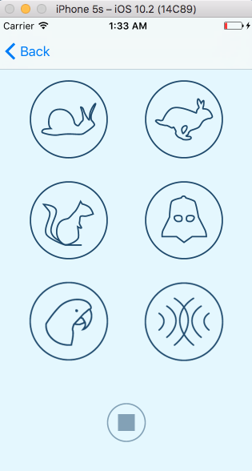

# PitchPerfect :smile:

## installation
you must have xCode IDE installed already on your mac OS X or you can download it from [HERE](https://developer.apple.com/xcode/)
open the Project in your xCode
Iam using Swift 3

## to Make Same App
follow [intro to iOS Development with Swift](https://www.udacity.com/course/intro-to-ios-app-development-with-swift--ud585) course made by Udacity as Part of [iOS Developer Nanodegree](https://www.udacity.com/course/ios-developer-nanodegree--nd003)

## Additional information and Resourses
I used Apple’s new Programming Language called Swift See [Swift’s Documentation 1](https://developer.apple.com/library/prerelease/content/documentation/Swift/Conceptual/Swift_Programming_Language/) [Swift’s Documentation 2](https://swift.org/documentation/)

## about this APP
this app is Called PitchPerfect and it is used for Recording your Voice and play it back with different effective Sounds.
I will be appriciated if you try it :smile: and add your own changes or fix any Issue faced you

you can Choose from these effects blew :

